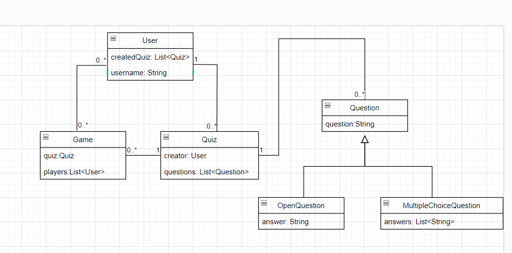

# TP 1-2 TAA
## Lucas Thébault

## Travail effectué
J'ai conçu un modèle relationnel simple avec 4 entités (détaillées plus bas) dont une avec héritage. 

Les 4 cardinalités de relations sont représentées.

Mon API comprend 8 endpoints (beaucoup plus dans la version Spring), avec des méthodes GET et POST.

Swagger ne fonctionne pas correctement. La page http://localhost:8080/api/#/ s'affiche mais elle n'affiche pas du tout mon API.

## Modèle relationnel

Mon modèle est simple. Il se compose de 4 entités :
- `User` : représente un utilisateur avec un nom (`username`) et la liste des quiz (`createdQuiz`) qu'il a créés.
- `Quiz` : représente un quiz d'un système comme Kahoot. Un quiz comprend son créateur (`creator` de type `User`) et la liste de ses questions (`questions`).
- `Question` : représente une question d'un quiz. Il s'agit d'une classe abstraite avec un champ `question` représentant la question qui est posée. Deux classes concrètes l'étendent :
- - `OpenQuestion` : représente une question à choix unique. Le champ `answer` correspond à la (seule) réponse correcte à la question, par exemple : `question : Quelle est la capitale de la France ?` `answer : Paris`
- - `MultipleChoiceQuestion` : représente une question à choix multiple. Le champ `answers` correspond aux réponses proposées à l'utilisateur. On peut décider par exemple que la première est la bonne réponse (et que les questions seront mélangées au front...).
- `Game` : représente une session de jeu avec son `quiz` et ses participants `players`.

En voici un schéma avec les relations :

## API

L'API est très simpliste et mieux étendue dans la version avec Spring.

- `GET /user/{userId}` : Renvoie l'utilisateur d'id `userId`.
- `POST /user` : Crée un utilisateur.
- `GET /quiz/{quizId}` : Renvoie le quiz d'id `quizId`.
- `POST /quiz` : Crée un quiz.
- `GET /question/{questionId}` : Renvoie la question d'id `questionId`.
- `POST /question` : Crée une question.
- `GET /game/{gameId}` : Renvoie le jeu d'id `gameId`.
- `POST /game` : Crée une partie de jeu.

Elle renvoie (et consomme) du XML car je n'ai jamais réussi à faire fonctionner JSON.

## Problèmes et difficultés

Je n'ai pas eu de problème particulier pour comprendre la théorie : j'ai bien compris les concepts de JPA, comment fonctionnait la conversion classes vers modèle relationnel, le concept d'API REST (même si je connaissais déjà), etc.

En revanche, j'ai eu beaucoup de mal à setup le projet, à installer les dépendances, etc. J'ai d'ailleurs même eu du mal à le lancer.

Par exemple, l'application consomme du XML car ça n'a jamais marché avec JSON. La documentation Swagger ne marche pas (ou alors je n'ai pas compris comment l'utiliser). J'ai quand même écrit des annotations sur certains endpoints. J'ai utilisé MySQL car je n'ai pas réussi à utiliser hsqldb.

Je dois enfin vous signaler que je suis complètement dispensé d'assiduité dû à mon statut d'étudiant aidant. J'ai donc très peu de temps pour travailler (seulement quelques heures par jour et tard le soir), pas de binôme et pas d'accès aux salles de TP. J'ai donc un peu privilégié la théorie. L'API est beaucoup plus complète dans la version Spring.
